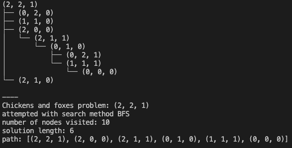
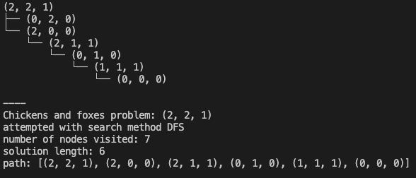
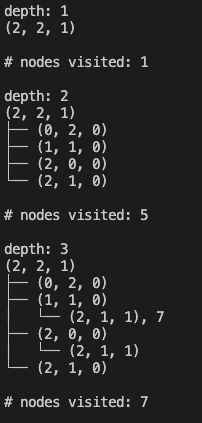
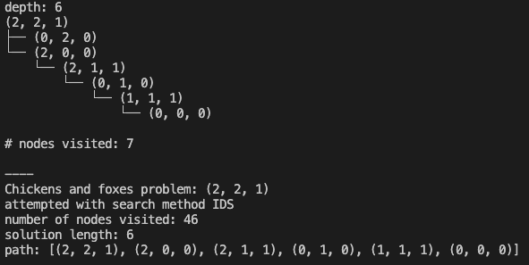
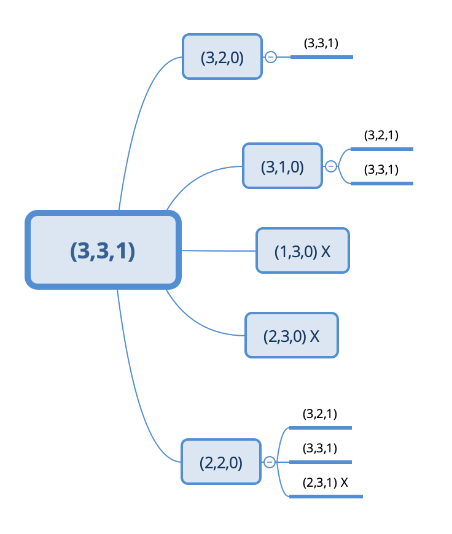
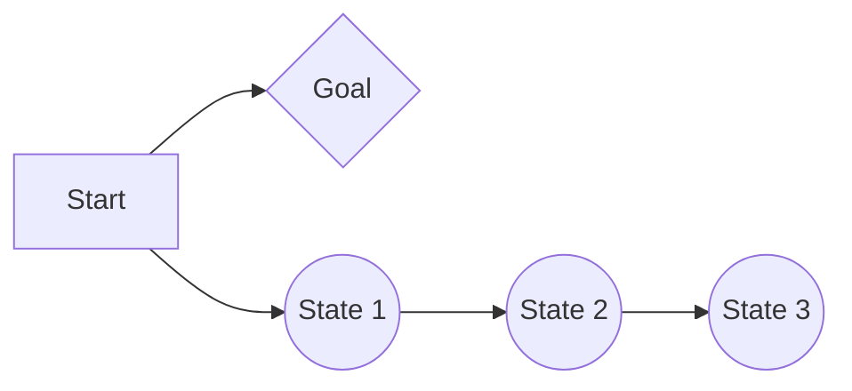

# CS76 22F: PA1 - Genghe Zhu

## Important: How to run ``uninformed_search.py``
My code uses the python library (https://treelib.readthedocs.io/en/latest/) to visualize the trees that BFS, DFS, and IDS run on. To run my code, follow the instructions in the link above (or type the command ``pip install treelib`` in your terminal). 

This changes the implementation of my search algorithms in ``uninformed_search.py`` but not ``FoxProblem.py``. At the top of ``FoxProblem.py``, I have added an import line: ``from treelib import Node, Tree``. The parameters for the BFS, DFS, and IDS functions have changed as follows:
#### Original Functions: 
- ``def  bfs_search(search_problem):`` 
- ``def  dfs_search(search_problem, depth_limit=100, node=None, solution=None):``
- ``def  ids_search(search_problem, tree_visual = False, depth_limit=100):``
#### My Functions:
- ``def  bfs_search(search_problem, tree_visual = False):`` 
- ``def  dfs_search(search_problem, tree_visual = False, depth_limit=100, node=None, solution=None, tree=None):``
- ``def  ids_search(search_problem, tree_visual = False, depth_limit=100):``

As you can see, I have added a ``tree_visual`` parameter in all three of the functions. It is set to ``False`` by default, so calling the functions without specifying any ``tree_visual`` parameter will not show anything. It is important to note that for ``dfs_search()``, there is another extra parameter ``tree`` to pass the visualized tree on each recursive call. Additionally, ``tree_visual`` is the second parameter (not the last). Here are some examples of how to call my functions: 

#### Default call (no visualization):
``problem331 = FoxProblem((3, 3, 1))``
``print(bfs_search(problem111))``
``print(dfs_search(problem111))``
``print(ids_search(problem111))``

Alternatively, this also works:
``problem331 = FoxProblem((3, 3, 1))``
``tree_visual = False``
``print(bfs_search(problem221, tree_visual))``
``print(dfs_search(problem221, tree_visual))``
``print(ids_search(problem221, tree_visual))``
#### Visualization call
``problem331 = FoxProblem((3, 3, 1))``
``tree_visual = True``
``print(bfs_search(problem221, tree_visual))``
``print(dfs_search(problem221, tree_visual))``
``print(ids_search(problem221, tree_visual))``

## Implementation Description
**1. Model (``FoxProblem.py``)** 

I implemented four methods (along with a constructor) in ``FoxProblem.py``:

- Constructor: There are 4 instance variables in the constructor - ``start_state``, ``goal_state`` ``total_chicken`` and ``total_fox``. ``total_chicken`` and ``total_fox`` are used later when I calculate legal moves.
- ``get_successors(self, state):``  evaluates the 5 possible moves (2 chickens on boat, 1 chicken, 2 foxes, 1 fox, 1 fox + 1 chicken) and returhs a list of possible successors. It calls helper functions: ``try_move()`` and ``safe_state()``.
- ``try_move(self, state, move):`` takes in a current state and a move (2 chickens on boat, 1 chicken, 2 foxes, 1 fox, 1 fox + 1 chicken) and returns a new state based on which side the boat is currently on. 
- ``safe_state(self, state):`` evaluates if a state is legal (i.e. foxes don't outnumber chickens on either side). It is important to note that this condition does not apply when there are only foxes or only chickens on one side. It also makes sure that a move does not exceed ``total_chicken`` or ``total_fox`` or have negative numbers of chicken or foxes. 
- ``goal_test(self, state):`` evaluates if a state is the end goal: (0, 0, 0). 

**2. Breadth-First Search (BFS)**

My BFS function basically implements the pseudocode for graph BFS in the slides. The major difference is that I also visualize the tree, so whenever I add a node to the visited nodes set, I also add it to the visualized tree. The visualized tree is displayed in the end. 

**3. Depth-First Search (DFS)**

My DFS function is recursive and has three base cases: reached depth limit, node already visited, and reached goal state. If none of these conditions are true, it checks all the child nodes recursively. Since we do not want to memoize the whole tree - which would defeat the purpose of DFS's memory advantage - I only save the nodes visited in a specific branch in ``solution.path`` (which is a list). In the failure state, it just removes all the nodes from ``solution.path``. 

**4. Iterative Deepening Search (IDS)**

My IDS function loops through the depth limits and calls my DFS function. Each time, it also prints out a visual of the tree. This was particurlarly challenging because I had to make the visual tree work for cases that found and didn't find solutions. 

## Search Algorithm Evaluation
I evaluated my algorithms by checking the printed visual tree from my output. I mainly tested my algorithms on 5 test cases: 

``problem111 = FoxProblem((1, 1, 1))``

``problem221 = FoxProblem((2, 2, 1))``

``problem331 = FoxProblem((3, 3, 1))``

``problem541 = FoxProblem((5, 4, 1))``

``problem551 = FoxProblem((5, 5, 1))``

All of the cases except for (5,5,1) produce an actual solution. Here is my example output from running (2,2,1):

**BFS**

**DFS**

**IDS** 

> **Note:** skipped the middle layers

As you can see, all the algorithms work. We can tell since the visualized tree is traversed as we expect (note the tree is printed alphabetically, so not necessarily in the exact order that we expanded). For example, when we run (3,3,1), it is the same as our hand drawn tree seen later in the discussion questions. When we run (5,4,1), we can see that BFS and IDS gave an optimal solution (solution length 16) while DFS did not give an optimal solution (solution length 18), which is exactly what we expect. We can also see that IDS visits much more nodes than either BFS or DFS. This is what we expect, since it runs DFS many times. Moreover, we can really see the speed advantage when we run a big problem like (20,18,1); BFS finds a solution very quickly (at the cost of more memory), while DFS and IDS take VERY long. 

## Discussion Questions

**Discussion question 1:** upper bound on number of states without considering legality of states. 

The total number of possible states can be given by the formula: (total number of chickens + 1) * (total number of foxes + 1) * 2. This is because there an be a state with 0 chickens or 0 foxes on either bank (so you add 1 to both), and the boat can be on either side (so you multiply by 2). For example, for (3,3,1), the total number of states is 4 * 4 * 2 = 32 states. 

**Discussion question 2:** draw part of the graph with all the states

> **Note:** Illegal states are marked with a 'X' after. For example, (2,3,0) is illegal and marked as such with '(2,3,0) X'.

**Discussion question 3:** path checking DFS vs. BFS

Path checking BFS saves significant memory since it only saves the specific branch of the tree that DFS is currently traversing in case DFS needs to backtrack. However, it may be much slower than BFS when the goal is very shallow, but DFS traverses another branch first. For example, see the following graph below:

In this example, path checking DFS will recurse down the branch until state 3 (potentially state N) while BFS will avoid going down that whole path and find the goal state after only checking state 1. 

**Discussion question 4:** memoizing DFS vs. BFS

Memoizing DFS will use similar memory to DFS since the entire tree is stored. This gets rid of the memory advantage of DFS compared to BFS.

**Discussion question 5:** Path Checking DFS in IDS vs Memoizing DFS in IDS vs. BFS

You would want to use path checking IDS when you care about memory and BFS when when you care about speed. Note that even though the worse case time complexity for BFS and path checking DFS in IDS is the same, BFS is faster.

| Algorithm                | Time Complexity | Space Complexity |
| ------------------------ | --------------- | ---------------- |
| Path Checking DFS in IDS | O(b^d)          | O(b*d)           |
| Memoizing DFS in IDS     | O(b^m)          | O(b^m)           |
| BFS                      | O(b^d)          | O(b^d)           |

**Discussion question 6:** Lossy Chickens and Foxes

There would be more possible states in this problem since now we can have states with less chickens than foxes. For example, if E = 5, than a state like (10,12,1) would be legal. This means that we would need to change our `get_successors()` function in `FoxProblem.py` to account for these new possible states. The upper bound for the number possible states is (# chickens + 1) * (# foxes + 1) * 2 * (E + 1).

