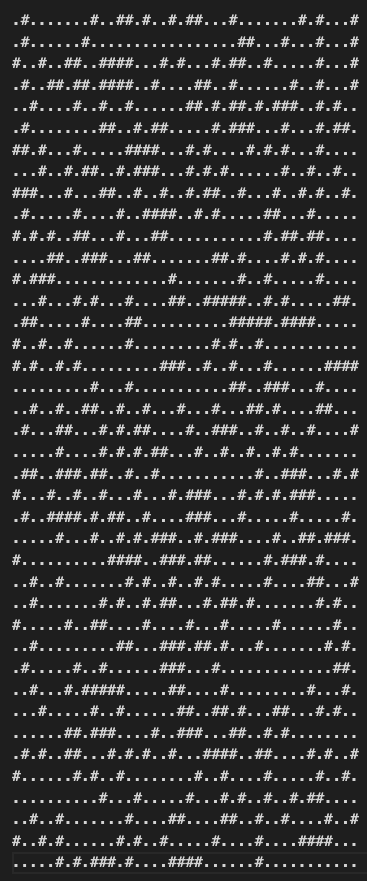
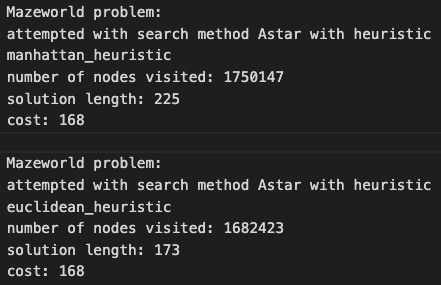
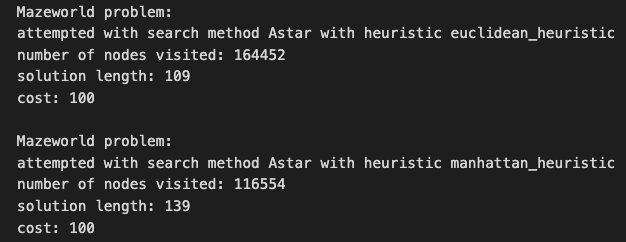
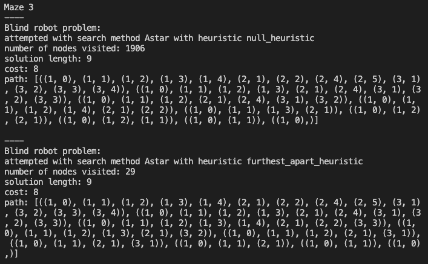

# CS76 22F: PA1 - Genghe Zhu

## Introduction
This report goes over three main sections. The first section describes how I implemented A*, the Mazeworld problem, and the Sensorless Problem. The second section evaluates the testing and results of my program. The third section responds to the discussion questions. 

## Implementation
**1. A-Star Algorithm (``astar_search.py``)**
Using hints from the instructions, I used a heap to keep track of the nodes that I already visited. I then used a dictionary to access the overall cost associated with every state. Thus, once we add on a heuristic function, can add the cost with the heuristic cost to get an order of nodes to visit in the heap. 

The function then continues until the priority queue is empty with the stopping condition of reaching a goal state (in which case, it will backchain to the starting node and count the number of nodes visited). If not, it will loop through the each child of the current state and get its visited cost. It will then add the child to the heap according to their transition cost. If the state is not in the dictionary, it will add the state and the cost to the dictionary. If it is already in the dictionary, it will only update the dictionary cost if the cost is lower. At the end of the loop, if the heap is empty, it will return the null solution case. 

**2. Mazeworld Implementation (``MazeworldProblem.py``)**
Mazeworld problem contains all the helper functions needed to run the A-star algorithm. Below, I list and describe the helper functions that I implemented (besides the constructor and already given functions):

- ``get_successors(self, locations):`` evaluates a robot's possible moves (North, South, East, West). One tricky part of this implementation is that the ``self.maze.robotloc`` instance variable saves which robot moves in the first integer of the list, and then the locations of all the robots in the list after. This is to account for the possibility that a robot may not be able to move as a possible successor. 

- ``check_move(self, x, y):`` is a helper function that ``get_successors`` calls. It checks if a robot goes out of bounds, if the robot hits an obstacle, and if the coordinate already has another robot. 

- ``goal_test(self, locations):`` checks if the robot has reached its goal by comparing the robots' current locations with the goal locations saved in the instance variable. 

- ``move_cost(self, state, new_state):`` is a uniform cost function. The only tricky part is that if a robot does not move, the move_cost is 0. 

- ``manhattan_heuristic(self, state):`` is a heuristic I use that calculates the manhattan distance from each robot to its goal location, and then returns the sum. 

- ``euclidean_heuristic(self, state):`` is another heuristic function that I use to calculate the sum of the euclidian distances from each robot to its respective goal location. 

**3. Sensorless Implementation (``SensorlessProblem.py``)**
Sensorless problem is structured very similarly to mazeworld. The major difference is the get successors function and the heuristic functions. Below, I list and describe the helper functions that I implemented (besides the constructor and already given functions):

- ``get_successors(self, state):`` tries moves of up, down, left, and right. It calls the ``try_direction`` helper function to get a list of successors. 

- ``try_direction(self, move, state, successors):`` is a helper function that ``get_successors`` calls. It checks if a robot moves into another floor tile. If so, it adds it to new successors. If not, the original location is added. 

- ``goal_test(self, locations):`` checks if the robot has reached its goal if the number of possible locations is reduced to 1. 

- ``move_cost(self, state, new_state):`` is a uniform cost function that always returns 1. 

- ``null_heuristic(self, state):`` is a null heuristic function that always returns 0. This makes A-star essentially the same as UCS.

- ``state_length_heuristic(self, state):`` is a heuristic I use that calculates the total amount of locations in each state. This was mentioned in class, but it is not admissible. 

- ``furthest_apart_heuristic(self, state):`` is another heuristic function that I use to calculate the furthest distances between x coordinates and y coordinates. Ideally, the path will trend to having robots that are closer together rather than further apart.  

- ``convert_path(self, path):`` is a helper function for the ``animate_path`` function so that our path is converted into the right format. 

**3. Other Implementation Notes**
- ``GenerateMaze.py`` is a file that I wrote that randomly generates new mazes given maze dimensions, number of robots, and the percent of the maze to be covered with obstacles. It checks if each maze has at least 1 move for each robot (so it will never generate a maze where no robots can make any moves). It outputs the maze into .maz files for the other programs to run. 

## Evaluation and Testing 
I tested my Mazeworld and Sensorless problems on a total of 10 mazes (mostly generated by ``GenerateMaze.py``). The test code can be seen in my ``test_mazeworld.py`` and ``test_sensorless.py`` files. I also tested no solution cases for both robots and the algorithm does not give any solutions. For Mazeworld, my code worked as intended since my A-star algorithm had the optimal path (validated with UCS) while checking far fewer states than UCS. 

Interestingly, my hypothesis that the manhattan distance heuristic would always be better did not turn out to be correct. For instance, on a large 40 by 40 maze with 2 robots starting in the bottom left corner (starting locations = (0,0) and (0,1)), here are my results:

- 40x40 Maze:

- Example 1: goal locations = [(38,39), (38,38)]
    

- Example 2: goal locations = [(2,39), (2,38)]

As you can see, Euclidian heuristic actually runs better than Manhattan heuristics for example 1. I hypothesize that this is because the robots must take a sort of diagonal path that is more similar to Euclidian distance. I test this hypothesis by looking at example 2, where the robots go in more of a straight path. we can see that this is the case, as the Manhattan outperforms Euclidian in example 2. 

For the Sensorless problem, I use a furthest distance between the x coordinates and y coordinates heuristic function. This heuristic doesn't overestimate the distance since the move cost is 1, so the maximum distance is the minimum of moves you need to make. Therefore, the heuristic is admissible and optimistic. This heuristic function outperforms the null heuristic by far, as seen in the output for maze 3 below:

## Discussion Questions

### Multi-robot coordination problem discussion questions 
1. To represent the state of the system, you need to know the locations of all k robots. In my code, I do this by a list of all of the x and y coordinates of each robot. We would also need a number in the beginning to track which robot is currently moving. Hence the total number needed is 2*k+1 numbers to reconstruct exactly the locations of all the robots and get the available actions from each state. 

2. Let us start with an estimate of the upper bound on the number of states with only one robot. This would be the number of coordinates on the board, or n^2. If there are k robots, then each robot can occupy different squares, so it would be (n^2)^k (not accounting for robots overlapping on the same square). Finally, we have to account for the fact that only one robot moves at a time, so we have k*(n^2)^k as an upper bound for the total number of states. 

3. To account for the number of possible collision states, let us instead count the number of legal states. Using our result from 2), we should just be able to subtract the illegal walls from our legal states: k*(n^2 - w)^k. Then assuming that all illegal states are just total states minus legal states, we get k[n^2^k - (n^2 - w)^k].

4. I do not expect this to be possible because it would take too much time and memory. BFS has exponential time and memory. 

5. I used the manhattan distance as a monotonic heuristic function. Monotonic just means that the original node's heuristic cost < step cost + neighbor node's heuristic cost. Since the manhattan heuristic is the smallest possible distance, and the cost to move between squares is uniform (1), our heuristic is monotonic. 

6. The 8-puzzle is just a 3x3 maze with 8 robots and 0 obstacles. It is a special case because there are certain states that are not possible (unsolvable mazes) given a specific goal. We can still use the manhattan cost as a heuristic because it is always admissible. 

7. We can first use BFS to get all possible states and add them into a set. We can then use A-star on a start state and the generated set to check for other nodes. In the end, we should only see two disjointed sets. 

### Blind robot problem discussion questions
1. I used a max distance between the edge robots in every state - meaning that I take the maximum x value and subtract the minimum x value, and add that to the maximum y value subtracted by the minimum y value. This heuristic is optimistic because the minimum number of moves needed is this distance to achieve the goal state of only 1 location. I also considered using the heuristic mentioned in class of the number of locations in a state, but realized it was not optimistic. 