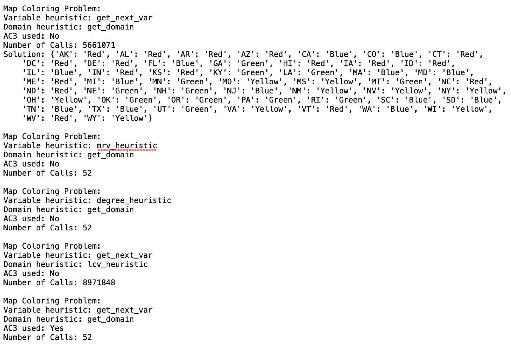

# CS76 22F: PA4 - Genghe Zhu

## Introduction
This report goes over three main sections. The first section describes how I implemented CSP, heuristics, and inference, map coloring, and circuit-board layout. The second section evaluates the testing and results of my program. The third section responds to the discussion questions. 

## Description

### Overall Code Organization
There are 6 main python files. ``CSP.py`` and ``Heuristics.py`` implement all of the CSP algorithms and heuristics. ``MapColoring.py`` and ``CircuitBoardLayout.py`` implement the specific problems, defining each with its set of variables, domains, and constraints. Finally, ``TestMapColoring.py`` and ``TestCircuitBoardLayout.py`` test the CSP algorithms. 

**1. CSP (``CSP.py``)**
The main CSP function is ``backtracking_search``, which calls ``recursive_backtracking``. I mostly implemented the pseudocode in the slides to recursively try all the values for each variables until it finds a solution. It has 5 helper functions:

- ``select_unassigned_variable`` selects the next variable to search. This is where variable heuristics are called (next section). 

- ``order_domain_values`` returns a list with a specific order of values to loop through. This is where domain heuristics are called (next section).

- ``consistent`` checks if assigning the value to the variable is consistent with the constraints. 

- ``assign_var_value`` assigns the variable the value and updates the domains of the neighbors. 

- ``AC3`` runs the arc consistency inference algorithm. It can be easily commented out. 

**2. Heuristics (``Heuristics.py``)**
There are two main types of heuristics: variable heuristics and domain heuristics. 

Variable heuristics include:

- ``get_next_var`` doesn't use any heuristic. Just returns the next variable that still need to be assigned. 

- ``mrv_heuristic`` implements the minimum remaining values heuristic. This returns the next variable to explore by choosing the variable with the fewest legal values. 

- ``degree_heuristic`` implements the heuristic that chooses the variable with the most number of constraints on the remaining variables. It calls ``num_constraints`` as a helper function to count the number of constraints. 

Domain heuristics include:

- ``get_domain`` simply returns all the possible domains for a variable. This doesn't use any heuristic.

- ``lcv_heuristic`` implements the least constraining value heuristic. In other words, returns a sorted list of values to explore, with the first being the value that allows the rest of the nodes to have the greatest possible domains. 

**3. Inference (``CSP.py``)**
Inference implements the AC3 algorithm from the slides. Essentially, arc consistency prunes values from the domains given the constraints, so that we don't have to search through as many values. There are three main steps. The first step is to add all the constraints as arcs (and the opposite). Ex: NSW boarders V, and V also boarders NSW. Step two is to test the domains against the constraints. If the domains change, then we have to re-add the arc with the variable on the right hand side to the queue again. ``AC3`` calls a helper function ``test_domain_constraint`` to see if the current domain changes after testing the constraint. 

**4. Map Coloring (``MapColoring.py``)**
Map coloring takes in three things as input: 
- Variables (ex: states of Australia)
- Domain (ex: colors red, green, blue)
- Constraints (ex: which states boarder other states in Australia)

Map coloring then creates a dictionary for possible domains for each variable. For example, every variable starts off with having R,G,B. However, as states get assigned values (colors), then that color drops out from its possible domains. This is used in AC3. Map coloring then calls the backtracking function from CSP to solve and prints out a nicely formatted result. 

**5. Circuit-Board Layout (``CircuitBoardLayout.py``)**
Note: my circuit board assumes that you can flip the components. 

Circuit board layout takes in two things as input:
- Variables (components): Each component is a list of points with (0,0) in the lower left corner. For example, if we wanted a 3 row by 2 column component, we would imput [(0.0),(0,1),(1,0),(1,1),(2,0),(2,1)]. I implemented it this way so that we can accomodate weird shapes (triangle, L-shape, donut, etc.) and flip them.
- Board dimensions: (rows, columns) 

I then construct some dictionaries as instance variables for components:
- possible_domains
- component_size: saves the biggest x and biggest y dimension. Ex: height and width for rectangle, or height and width for triangle. This is useful when checking if we can rotate the component without covering other components. 
- allow_rotations: tries to rotate 90 deg, 180 deg, and 270 deg. Then checks if the rotated/flipped shape is the same as the original shape. If so, it removes the duplicated shape. Ex: a square rotated is still the same shape. No need to save duplicates in memory.

I loop through components and call the following functions to fill the constructed dictionaries:
- ``get_component_xy_size``
- ``generate_allow_rotations``
- ``generate_possible_domains``

Note: I also decided to create an index ``i`` as the key to the component, since using the list of points for each component as the key would be hard to work with. 

Finally, I add the constraints. The constraints simply are that each component cannot be on top of another componen (overlap), so each component effectively has a constraint with another. 

When I display the results, the capital letters indicate not rotated (original shapes) while lower case letters indicate rorated shapes. 

## Evaluation and Testing 
I tested both Map Coloring and Circuit-Board Layout on many test cases. The results of all of those test cases can be found in ``results.txt``. The code to test them are from ``TestMapColoring.py`` and ``CircuitBoardLayout.py``. Here, I will highlight the most important test cases. For space reasons, I did not include the solution (since it was the same) in examples A.2 and B.2. Below we can see that the algorithm runs well for the given test cases in both Map Coloring and Circuit-Board Layout (A.1 and A.2). We can also see how the usage of the different heuristics changes the number of nodes visited in A.2 and B.2. Overall, we can see that different heuristics work better for different types of problems. For example, ``get_domain`` works well for the US map, but doesn't work well for the hard Circuit-board. On the other hand, ``lcv_heuristic`` does horribly for the US map, while it performs very well for the hard Circuit-board.

I'd also like to note that in B.2, we can see that none of the shapes are squares or rectangles. This shows our algorithm works well for these harder cases. 

### A. Map Coloring Test Cases

**A.1: Australia Map**

**A.2: United States Map**

### B. Circuit-Board Layout Test Cases

**B.1: Given Circuit-Board**

**B.2: Harder Circuit**

## Discussion Questions

### Map Coloring Test
1. As stated above, the solver works well with the mrv and get_domain heuristics, but not well with the lcv heuristic. The AC3 inference also works well in decreasing the number of nodes visited. By testing it on a large map (US instead of AUS), we can see the value of how heuristics and inference drastically increases performance. 

2. The domain of each piece will be determined by the board dimensions. The piece must fit entirely on the board, so the domain is board width - component width and board height - component height. 

3. The constraints that would prevent components from overlapping. While my code handles the case where pieces can rotate, for the sake of this problem (and simplicity), assume that pieces cannot rotate. Then the legal pairs of points would be for (location of a), (location of b):  [((0,0), (3,0)), ((1,0), (4,0)), ((2,0), (5,0)), ((0,1), (3,1)), ((1,1), (4,1)), ((2,1), (5,1)), ((6,0), (0,0)), ((7,0), (1,0)), ((8,0), (2,0)), ((6,1), (0,1)), ((7,1), (1,1)), ((8,1), (2,1))]

4. I do not convert the components to integers because I already hold the domains in a dictionary. Since CSP solver does not care what the input values are, my code still works the same way. I did have to include an ``allow`` function for both Map Coloring and Circuit Board Layout. 